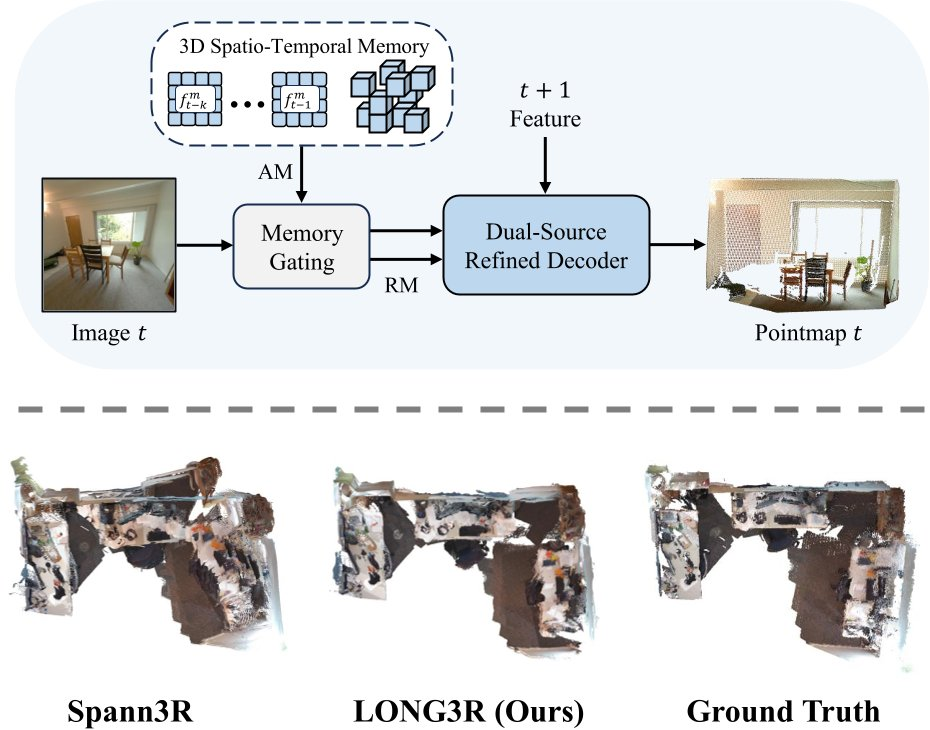

# LONG3R
### [[Paper]](https://arxiv.org/abs/2507.18255) [[Project Page]](https://zgchen33.github.io/LONG3R/)

> [**LONG3R: Long Sequence Streaming 3D Reconstruction**](https://zgchen33.github.io/LONG3R/),            
> [Zhuoguang Chen<sup>*</sup>](https://zgchen33.github.io), [Minghui Qin<sup>*</sup>](), [Tianyuan Yuan<sup>*</sup>](), [Zhe Liu](), [Hang Zhao<sup>†</sup>](https://hangzhaomit.github.io/) <br>
> *Equal contribution  † Corresponding author

Official implementation of "LONG3R: Long Sequence Streaming 3D Reconstruction".

<div align="center">
  
</div><br/>

## Code Coming Soon.

## BibTeX

```bibtex
@article{long3r,
  title={LONG3R: Long Sequence Streaming 3D Reconstruction}, 
  author={Zhuoguang Chen and Minghui Qin and Tianyuan Yuan and Zhe Liu and Hang Zhao},
  journal={arXiv preprint arXiv:2507.18255},
  year={2025}
}
```